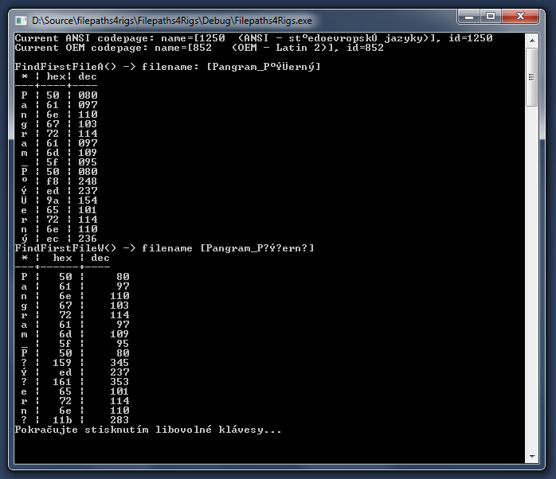

# Notes on MS Windows

NTFS filesystem (default in all recent Windows) uses Unicode, see "[MSDN: Character Sets Used in File Names](https://msdn.microsoft.com/en-us/library/windows/desktop/dd317748(v=vs.85).aspx)"

There's a concept of "[ANSI Code Page](https://en.wikipedia.org/wiki/Windows_code_page#ANSI_code_page)" represented 
by functions `GetACP()` and `CP_ACP` from function `GetCPInfoEx()`.

Apparently `FindFirstFileA()` and probably all other `*A()` file path functions return garbage for Unicode paths. 
Specifically, they seem to convert the Unicode path using the currrent CP_ACP. The conversion is lossy and the result path
may be useless for file access. This is what I got from my home PC using Czech localization:



```
Current ANSI codepage: name=[1250  (ANSI - st°edoevropskÚ jazyky)], id=1250
Current OEM codepage: name=[852   (OEM - Latin 2)], id=852

FindFirstFileA() -> filename: [Pangram_P°ÝÜerný]
 * | hex| dec
---+----+----
 P | 50 | 080
 a | 61 | 097
 n | 6e | 110
 g | 67 | 103
 r | 72 | 114
 a | 61 | 097
 m | 6d | 109
 _ | 5f | 095
 P | 50 | 080
 ° | f8 | 248
 Ý | ed | 237
 Ü | 9a | 154
 e | 65 | 101
 r | 72 | 114
 n | 6e | 110
 ý | ec | 236
FindFirstFileW() -> filename [Pangram_P?Ý?ern?]
 * |  hex | dec
---+------+----
 P |   50 |     80
 a |   61 |     97
 n |   6e |    110
 g |   67 |    103
 r |   72 |    114
 a |   61 |     97
 m |   6d |    109
 _ |   5f |     95
 P |   50 |     80
 ? |  159 |    345
 Ý |   ed |    237
 ? |  161 |    353
 e |   65 |    101
 r |   72 |    114
 n |   6e |    110
 ? |  11b |    283
Pokračujte stisknutím libovolné klávesy...

```

TODO: Screenshot and text from 'U.S.English' computer.

So far I didn't find MSDN page that would explicitly say "`*A()` functions returning paths convert Unicode via `CP_ACP`",
but it's probably somewhere deep in there...
